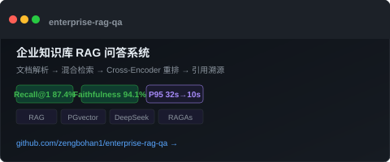
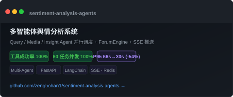
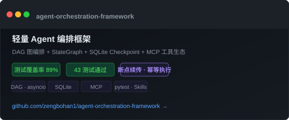

  

  
  

## Toolbox

  
  
  
  
  
  
  
  
  
  
  

## Featured projects

  

  

  

## GitHub activity

  <picture>
    <source media="(prefers-color-scheme: dark)" srcset="./profile/stats-dark.svg" />
    <source media="(prefers-color-scheme: light)" srcset="./profile/stats-light.svg" />
    
  </picture>
  <picture>
    <source media="(prefers-color-scheme: dark)" srcset="./profile/languages-dark.svg" />
    <source media="(prefers-color-scheme: light)" srcset="./profile/languages-light.svg" />
    
  </picture>

## Contribution trail

  <picture>
    <source media="(prefers-color-scheme: dark)" srcset="./profile/github-snake-dark.svg" />
    <source media="(prefers-color-scheme: light)" srcset="./profile/github-snake.svg" />
    
  </picture>

  Profile assets refresh automatically every day with GitHub Actions · 📬 bohan.zeng1@outlook.com

