  

  
  

  

    
    <strong>I'm currently focused on AI Application Development.</strong>
  

  

    <code>🐔 Born 2005.06.20 · ShanDong, China.</code>
    <code>📍 Now Base in HangZhou.</code>
  

## About

- 🎓 Software Engineering undergraduate, graduating in 2027
- 💻 Java backend development and Python AI application development
- 🧪 Focused on AI testing, RAG evaluation, agent orchestration, and high-concurrency services

## Toolbox

  
  
  
  
  
  
  
  
  
  
  

## Work Experience

| Period | Company | Role |
| --- | --- | --- |
| 2026.02 – Present | Hangzhou Suguang Network Technology | Java Backend Engineer |
| 2025.08 – 2026.01 | Linyi Jushan Intelligent Technology | Java Backend Engineer |
| 2025.05 – 2025.07 | Jinan Hechen Digital Technology | Java Backend Engineer |

> 📄 [View Details →](./WorkExperience.md)

## Open Source

- 🦌 **[Spring AI Alibaba](https://github.com/alibaba/spring-ai-alibaba)** contributor — Agentic AI framework for Java developers, 10K+ stars
- ✅ **[PR #4926](https://github.com/alibaba/spring-ai-alibaba/pull/4926)** — merged 2026-08-25 — `test(graph): pin List<byte[]> element types across serializer round-trip`

> 🏅 [View Awards →](./Awards.md)

## Featured Projects

| Project | Description | Highlights |
| --- | --- | --- |
| [enterprise-rag-qa](https://github.com/zengbohan1/enterprise-rag-qa) | Enterprise knowledge-base RAG Q&A with hybrid retrieval, reranking, and automated evaluation | Recall@1 87.4% · Faithfulness 94.1% · P95 32s → 10s |
| [sentiment-analysis-agents](https://github.com/zengbohan1/sentiment-analysis-agents) | Multi-agent sentiment analysis with parallel agents, SSE long-task control, and fault injection | 60 concurrent tasks · P95 66.2s → 30.3s · 265 tool calls at 100% success |
| [agent-orchestration-framework](https://github.com/zengbohan1/agent-orchestration-framework) | Lightweight agent orchestration with DAG scheduling, SQLite checkpoints, MCP, and Skills discovery | 43 tests passed · 89% core-module coverage |

## GitHub Activity

  <picture>
    <source media="(prefers-color-scheme: dark)" srcset="./profile/stats-dark.svg" />
    <source media="(prefers-color-scheme: light)" srcset="./profile/stats-light.svg" />
    
  </picture>
  <picture>
    <source media="(prefers-color-scheme: dark)" srcset="./profile/languages-dark.svg" />
    <source media="(prefers-color-scheme: light)" srcset="./profile/languages-light.svg" />
    
  </picture>

## Contribution Trail

  <picture>
    <source media="(prefers-color-scheme: dark)" srcset="./profile/github-snake-dark.svg" />
    <source media="(prefers-color-scheme: light)" srcset="./profile/github-snake.svg" />
    
  </picture>

  Profile assets refresh automatically every day with GitHub Actions · 📬 zengbh1@gmail.com · [Contact](./vx.md)

